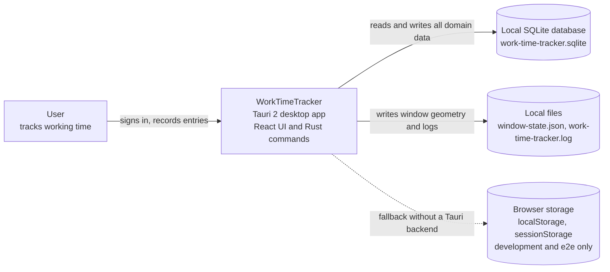
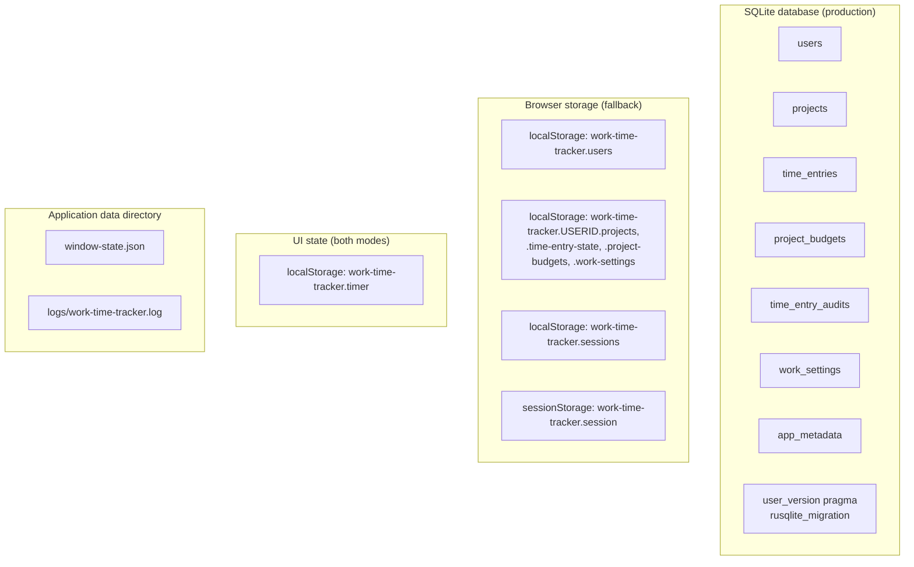
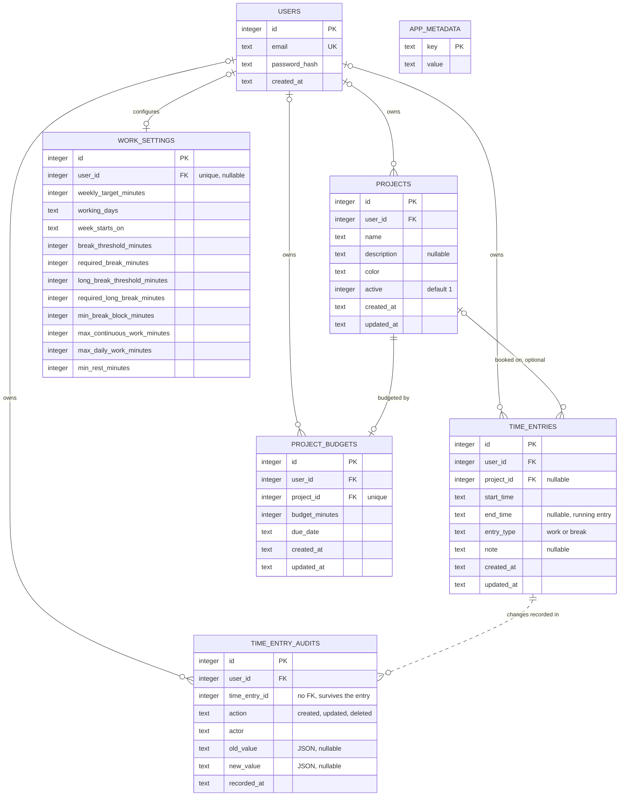

# Logical data model

This document describes what WorkTimeTracker persists today, as a logical model in C4 style
(context, container, component). It covers the client-side persistence layer only: the local SQLite
database of the desktop application and the browser fallback used for UI development and end-to-end
tests. There is no server and no external integration.

Sources: `drizzle/*.sql`, `src/db/schema.ts`, `src-tauri/src/database.rs`,
`src-tauri/src/models.rs`, `src/features/storage/local-repository.ts`, and the Zod schemas under
`src/features/*/*-schema.ts`.

## Level 1 — Context

All data stays on the machine. The application has no network storage and no synchronisation. The
only export is the monthly working time record, written as a CSV or PDF file by the user.

## Level 2 — Containers

| Container | Holds | Source |
| --- | --- | --- |
| `users`, `projects`, `time_entries`, `project_budgets`, `work_settings` | The domain entities, all scoped by user | `drizzle/0000_create_schema.sql`, `drizzle/0001_create_project_budgets.sql`, `drizzle/0003_create_users.sql` |
| `time_entry_audits` | Append-only trail of every change to a time entry | `drizzle/0004_working_time_records.sql` |
| `app_metadata` | Key/value pairs, today only `app_version` | `drizzle/0002_create_app_metadata.sql`, `src-tauri/src/database.rs` |
| SQLite `user_version` | Number of applied migrations, managed by `rusqlite_migration` | `src-tauri/src/database.rs` (`migrations`) |
| `work-time-tracker.users` | Browser fallback accounts including the PBKDF2 hash | `src/features/storage/local-repository.ts` |
| `work-time-tracker.<userId>.<store>` | Browser fallback copies of projects, time entries, budgets, settings | `src/features/storage/local-repository.ts` (`scopedKey`) |
| `work-time-tracker.sessions`, `work-time-tracker.session` | Browser fallback session with expiry; the token lives in `sessionStorage` | `src/features/storage/local-repository.ts` |
| `work-time-tracker.timer` | Timer session bookkeeping: project, carried milliseconds, paused | `src/features/timer/timer-store.ts` |
| `window-state.json` | Main window size, position, maximized flag | `src-tauri/src/window_state.rs` |
| `logs/work-time-tracker.log` | Redacted, rotated error log, no domain data | `src-tauri/src/logging.rs` |

In the desktop application sessions are not persisted: `Session` in `src-tauri/src/auth.rs` keeps
the signed-in user in memory only, so a restart returns to the login page.

## Level 3 — Entities

`APP_METADATA` has no relationship to the other entities, it is a standalone key/value store.

### users

`drizzle/0003_create_users.sql`, `src/db/schema.ts`, `src-tauri/src/models.rs`

| Field | Type | Required | Description | Key/index |
| --- | --- | --- | --- | --- |
| `id` | INTEGER | yes | Surrogate key | PK, autoincrement |
| `email` | TEXT | yes | Trimmed, lower-cased, at most 254 characters | UNIQUE |
| `password_hash` | TEXT | yes | Argon2id on the desktop, `pbkdf2-sha256$…` in the browser fallback | — |
| `created_at` | TEXT | yes | ISO 8601 UTC, set by SQLite `strftime` | — |

### projects

`drizzle/0000_create_schema.sql`, `drizzle/0003_create_users.sql`,
`src/features/projects/project-schema.ts`

| Field | Type | Required | Description | Key/index |
| --- | --- | --- | --- | --- |
| `id` | INTEGER | yes | Surrogate key | PK, autoincrement |
| `user_id` | INTEGER | nullable | Owner; `NULL` only for data of the former single-user database until the first registration claims it | FK to `users.id` ON DELETE CASCADE, index `projects_user_id` |
| `name` | TEXT | yes | Trimmed, 1 to 100 characters | — |
| `description` | TEXT | no | Trimmed, at most 500 characters, empty becomes `NULL` | — |
| `color` | TEXT | yes | `#rrggbb`, new projects cycle through `PROJECT_COLORS` | — |
| `active` | INTEGER | yes | Boolean, default `1` | — |
| `created_at`, `updated_at` | TEXT | yes | ISO 8601 UTC | — |

### time_entries

`drizzle/0000_create_schema.sql`, `drizzle/0003_create_users.sql`,
`src/features/time-entries/time-entry-schema.ts`

| Field | Type | Required | Description | Key/index |
| --- | --- | --- | --- | --- |
| `id` | INTEGER | yes | Surrogate key | PK, autoincrement |
| `user_id` | INTEGER | nullable | Owner | FK to `users.id` ON DELETE CASCADE, index `time_entries_user_id` |
| `project_id` | INTEGER | no | Booked project; becomes `NULL` when the project is deleted, the entry is kept | FK to `projects.id` ON DELETE SET NULL |
| `start_time` | TEXT | yes | Canonical ISO 8601 UTC with milliseconds, for example `2026-08-27T08:00:00.000Z` | index `time_entries_start_time` |
| `end_time` | TEXT | no | Same format, `NULL` marks the running entry | — |
| `entry_type` | TEXT | yes | `work` or `break` (`CHECK`), default `work`; a break carries no project | — |
| `note` | TEXT | no | Trimmed, at most 500 characters | — |
| `created_at`, `updated_at` | TEXT | yes | ISO 8601 UTC | — |

### time_entry_audits

`drizzle/0004_working_time_records.sql`, `src/features/time-entries/audit-schema.ts`

| Field | Type | Required | Description | Key/index |
| --- | --- | --- | --- | --- |
| `id` | INTEGER | yes | Surrogate key | PK, autoincrement |
| `user_id` | INTEGER | nullable | Owner | FK to `users.id` ON DELETE CASCADE, index `time_entry_audits_user_id` |
| `time_entry_id` | INTEGER | yes | Changed entry; no foreign key, so the trail outlives a deleted entry | — |
| `action` | TEXT | yes | `created`, `updated` or `deleted` (`CHECK`) | — |
| `actor` | TEXT | yes | E-mail of the signed-in user | — |
| `old_value`, `new_value` | TEXT | no | JSON of the entry before and after the change | — |
| `recorded_at` | TEXT | yes | ISO 8601 UTC | index `time_entry_audits_recorded_at` |

Rows are only inserted, never updated or deleted, and are kept for at least the retention period of
two years (`RETENTION_YEARS` in `src/features/compliance/compliance-rules.ts`).

### project_budgets

`drizzle/0001_create_project_budgets.sql`, `src/features/budgets/budget-schema.ts`

| Field | Type | Required | Description | Key/index |
| --- | --- | --- | --- | --- |
| `id` | INTEGER | yes | Surrogate key | PK, autoincrement |
| `user_id` | INTEGER | nullable | Owner | FK to `users.id` ON DELETE CASCADE, index `project_budgets_user_id` |
| `project_id` | INTEGER | yes | Budgeted project, at most one budget per project | FK to `projects.id` ON DELETE CASCADE, UNIQUE |
| `budget_minutes` | INTEGER | yes | Greater than zero (`CHECK`), entered in hours in the UI | — |
| `due_date` | TEXT | yes | Calendar date `YYYY-MM-DD` | — |
| `created_at`, `updated_at` | TEXT | yes | ISO 8601 UTC | — |

### work_settings

`drizzle/0002_work_settings_working_days.sql`, `drizzle/0003_create_users.sql`,
`src/features/settings/work-settings-schema.ts`

| Field | Type | Required | Description | Key/index |
| --- | --- | --- | --- | --- |
| `id` | INTEGER | yes | Surrogate key | PK, autoincrement |
| `user_id` | INTEGER | nullable | Owner, one row per user | FK to `users.id` ON DELETE CASCADE, UNIQUE |
| `weekly_target_minutes` | INTEGER | yes | 1 to 10080, default 2400 | — |
| `working_days` | TEXT | yes | Comma-separated weekdays, default `monday,tuesday,wednesday,thursday,friday` | — |
| `week_starts_on` | TEXT | yes | `monday` or `sunday`, default `monday` | — |
| `break_threshold_minutes` … `min_rest_minutes` | INTEGER | yes | The eight working time limits behind the compliance warnings, 1 to 1440 minutes each; the defaults are the German ArbZG values (360, 30, 540, 45, 15, 360, 600, 660) | — |

A user without a row reads `DEFAULT_WORK_SETTINGS`, the row is written on the first save
(`read_settings` and `write_settings` in `src-tauri/src/database.rs`).

### app_metadata

`drizzle/0002_create_app_metadata.sql`, `src-tauri/src/database.rs`

| Field | Type | Required | Description | Key/index |
| --- | --- | --- | --- | --- |
| `key` | TEXT | yes | Only `app_version` today | PK |
| `value` | TEXT | yes | `CARGO_PKG_VERSION`, written on every `Database::open` | — |

## Invariants and allowed values

Validation, overlap detection, and the security limits are defined once in
`contract/domain-rules.json` and asserted by `src-tauri/src/contract.rs` and
`src/features/storage/domain-rules.contract.test.ts`.

- User-owned CRUD queries are filtered by the signed-in user, entities of other users stay
  invisible; account lookup/count queries and `app_metadata` reads are intentionally not
  user-scoped.
- Time entries of one user must not overlap. A running entry (`end_time IS NULL`) counts as open
  ended, and switching projects reuses one timestamp so that no gap or overlap appears.
- `end_time`, when present, must be strictly later than `start_time`.
- Timestamps must be canonical UTC ISO 8601 with milliseconds, `due_date` must be a real calendar
  date.
- At most one budget per project, and `budget_minutes` greater than zero.
- At least one working day must be selected, working days are stored deduplicated in weekday order.
- A break entry carries no project, and `entry_type` is `work` or `break`.
- Working time limits are between 1 and 1440 minutes; the long break threshold and duration must not
  be below the short ones. Exceeding a limit only produces a warning, it never blocks recording.
- E-mail addresses are unique after trimming and lower-casing. Registration requires at least 20
  characters, upper and lower case letters, and two special characters.
- Security limits: session idle timeout 480 minutes, 5 failed logins, 15 minutes lockout.

Enums: `week_starts_on` is `monday` or `sunday`; `working_days` is a subset of `WEEKDAYS`
(`monday` to `sunday`); `color` is a `#rrggbb` value, offered from `PROJECT_COLORS`.

## Schema versions

`migrations()` in `src-tauri/src/database.rs` applies the files below in order. The number of
applied migrations is stored in the SQLite `user_version` pragma by `rusqlite_migration`.

| # | Migration | Change |
| --- | --- | --- |
| 1 | `0000_create_time_entries.sql` | Initial sample table `time_entries` |
| 2 | `0000_create_schema.sql` | Replaces it with `projects`, `time_entries`, `work_settings` |
| 3 | `0001_create_project_budgets.sql` | Adds `project_budgets` |
| 4 | `0002_create_app_metadata.sql` | Adds `app_metadata` |
| 5 | `0002_work_settings_working_days.sql` | Replaces `daily_target_minutes` with `working_days` |
| 6 | `0003_create_users.sql` | Adds `users`, the `user_id` columns with indexes, and per-user `work_settings` |
| 7 | `0004_working_time_records.sql` | Adds `time_entries.entry_type` and `time_entry_audits` |
| 8 | `0005_work_settings_compliance_limits.sql` | Adds the eight working time limits to `work_settings` |

Rows that predate migration 6 keep `user_id IS NULL` until the first registration claims them
(`claim_unowned_data` in `src-tauri/src/database.rs`, `claimLegacyData` in the browser fallback).

## Derived data (not persisted)

- Durations of entries and totals per project or range: `src/features/dashboard/metrics.ts`
- Daily target, working day checks, and scheduled minutes of a range:
  `src/features/settings/work-schedule.ts`
- Budget consumption and forecast: `src/features/budgets/budget-metrics.ts`
- Free slots for quick-added entries: `src/features/time-management/quick-add.ts`
- Elapsed time of a running timer, computed from `start_time`: `src/features/timer/use-timer.ts`
- Working days, break and rest compliance warnings: `src/features/compliance/compliance-rules.ts`
- Monthly CSV and PDF record per employee: `src/features/compliance/monthly-export.ts`
