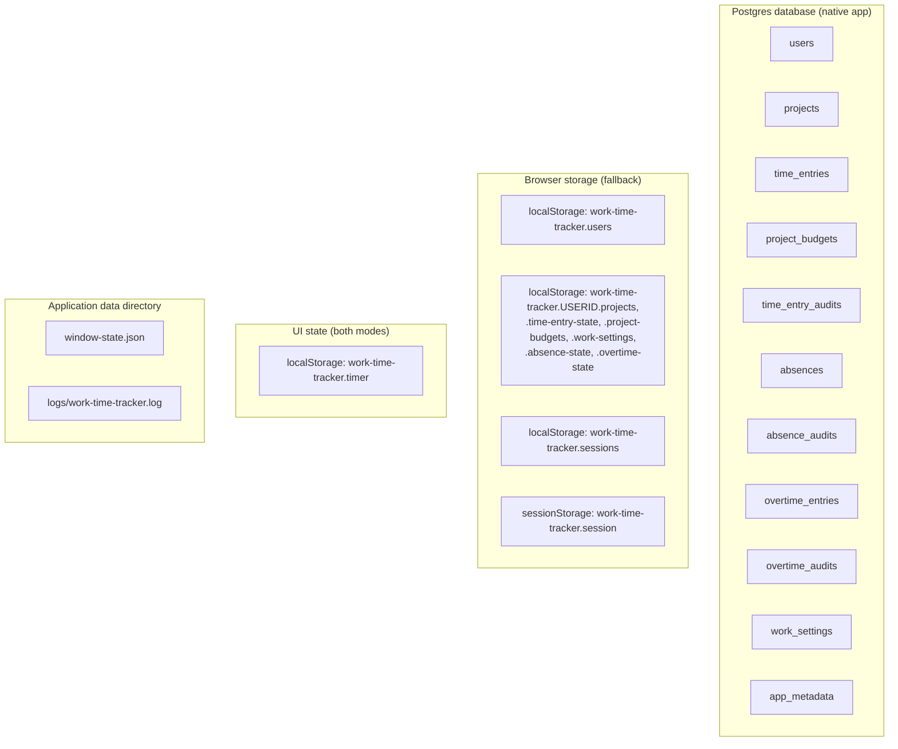
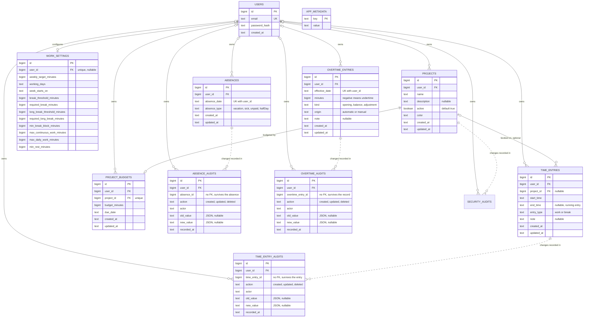

# Logical data model

This document describes what WorkTimeTracker persists today, as a logical model in C4 style
(context, container, component). It covers the native Postgres database used by the desktop
application and the browser storage fallback used only for UI development and end-to-end tests.
There is no remote application server and no external integration; the bundled compose database runs
locally through the bundled compose database.

Sources: `drizzle/0000_init.sql`, `src/db/schema.ts`, `src-tauri/src/postgres_store.rs`,
`src-tauri/src/models.rs`, `src/features/storage/local-repository.ts`, and the Zod schemas under
`src/features/*/*-schema.ts`.

## Level 1 — Context

All data stays on the machine by default. The only export is the monthly working time record,
written as a CSV or PDF file by the user.

## Level 2 — Containers

| Container | Holds | Source |
| --- | --- | --- |
| `users`, `projects`, `time_entries`, `project_budgets`, `work_settings` | The domain entities, all scoped by user | `drizzle/0000_init.sql`, `src-tauri/src/postgres_store.rs` |
| `time_entry_audits` | Append-only trail of every change to a time entry | `drizzle/0000_init.sql`, `src-tauri/src/postgres_store.rs` |
| `absences` | One row per absent calendar day, scoped by user | `drizzle/0000_init.sql`, `src-tauri/src/postgres_store.rs` |
| `absence_audits` | Append-only trail of every change to an absence | `drizzle/0000_init.sql`, `src-tauri/src/postgres_store.rs` |
| `overtime_entries` | Explicit overtime records per user: opening balance, correction, adjustment | `drizzle/0000_init.sql`, `src-tauri/src/postgres_store.rs` |
| `overtime_audits` | Append-only trail of every change to an overtime record | `drizzle/0000_init.sql`, `src-tauri/src/postgres_store.rs` |
| `login_attempts` | Failed logins per email behind the lockout, evicted when expired | `drizzle/0000_init.sql`, `src-tauri/src/postgres_store.rs` |
| `app_metadata` | Key/value pairs, today only `app_version` | `drizzle/0000_init.sql`, `src-tauri/src/postgres_store.rs` |
| `schema_migrations` | Applied migration versions, one row per file in `MIGRATIONS` | `src-tauri/src/postgres_store.rs` |
| `work-time-tracker.users` | Browser fallback accounts including the PBKDF2 hash | `src/features/storage/local-repository.ts` |
| `work-time-tracker.<userId>.<store>` | Browser fallback copies of projects, time entries, budgets, settings, absences, overtime | `src/features/storage/local-repository.ts` (`scopedKey`) |
| `work-time-tracker.sessions`, `work-time-tracker.session` | Browser fallback session with expiry; the token lives in `sessionStorage` | `src/features/storage/local-repository.ts` |
| `work-time-tracker.timer` | Timer session bookkeeping: project, carried milliseconds, paused | `src/features/timer/timer-store.ts` |
| `window-state.json` | Main window size, position, maximized flag | `src-tauri/src/window_state.rs` |
| `logs/work-time-tracker.log` | Redacted, rotated error log, no domain data | `src-tauri/src/logging.rs` |

In the desktop application sessions are not persisted: `Sessions` in `src-tauri/src/auth.rs` keeps
the signed-in user in memory only, so a restart returns to the login page. The frontend holds the id
of its session in a module variable of `src/features/storage/tauri-repository.ts` and in no storage
container of the webview, so a reload returns to the login page as well.

## Level 3 — Entities

`APP_METADATA` has no relationship to the other entities, it is a standalone key/value store.

### users

`drizzle/0000_init.sql`, `src/db/schema.ts`, `src-tauri/src/models.rs`

| Field | Type | Required | Description | Key/index |
| --- | --- | --- | --- | --- |
| `id` | BIGINT | yes | Surrogate key | PK, generated identity |
| `email` | TEXT | yes | Trimmed, lower-cased, at most 254 UTF-8 bytes | UNIQUE |
| `password_hash` | TEXT | yes | Argon2id on the desktop, `pbkdf2-sha256$…` in the browser fallback | — |
| `created_at` | TEXT | yes | ISO 8601 UTC | — |

### projects

`drizzle/0000_init.sql`, `src/features/projects/project-schema.ts`

| Field | Type | Required | Description | Key/index |
| --- | --- | --- | --- | --- |
| `id` | BIGINT | yes | Surrogate key | PK, generated identity |
| `user_id` | BIGINT | nullable | Owner; `NULL` rows can be claimed by the first registered user | FK to `users.id` ON DELETE CASCADE, index `projects_user_id` |
| `name` | TEXT | yes | Trimmed, 1 to 100 characters | — |
| `description` | TEXT | no | Trimmed, at most 500 characters, empty becomes `NULL` | — |
| `color` | TEXT | yes | `#rrggbb`, new projects cycle through `PROJECT_COLORS` | — |
| `active` | BOOLEAN | yes | Default `true` | — |
| `created_at`, `updated_at` | TEXT | yes | ISO 8601 UTC | — |

### time_entries

`drizzle/0000_init.sql`, `src/features/time-entries/time-entry-schema.ts`

| Field | Type | Required | Description | Key/index |
| --- | --- | --- | --- | --- |
| `id` | BIGINT | yes | Surrogate key | PK, generated identity |
| `user_id` | BIGINT | nullable | Owner | FK to `users.id` ON DELETE CASCADE, index `time_entries_user_id` |
| `project_id` | BIGINT | no | Booked project; becomes `NULL` when the project is deleted, the entry is kept | FK to `projects.id` ON DELETE SET NULL |
| `start_time` | TEXT | yes | Canonical ISO 8601 UTC with milliseconds, for example `2026-08-27T08:00:00.000Z` | index `time_entries_start_time` |
| `end_time` | TEXT | no | Same format, `NULL` marks the running entry | — |
| `entry_type` | TEXT | yes | `work` or `break` (`CHECK`), default `work`; a break carries no project | — |
| `note` | TEXT | no | Trimmed, at most 500 characters | — |
| `created_at`, `updated_at` | TEXT | yes | ISO 8601 UTC | — |

### time_entry_audits

`drizzle/0000_init.sql`, `src/features/time-entries/audit-schema.ts`

| Field | Type | Required | Description | Key/index |
| --- | --- | --- | --- | --- |
| `id` | BIGINT | yes | Surrogate key | PK, generated identity |
| `user_id` | BIGINT | yes | Owner | FK to `users.id` ON DELETE CASCADE, index `time_entry_audits_user_id` |
| `time_entry_id` | BIGINT | yes | Changed entry; no foreign key, so the trail outlives a deleted entry | — |
| `action` | TEXT | yes | `created`, `updated` or `deleted` | — |
| `actor` | TEXT | yes | E-mail of the signed-in user | — |
| `old_value`, `new_value` | TEXT | no | JSON of the entry before and after the change | — |
| `recorded_at` | TEXT | yes | ISO 8601 UTC | — |

Rows are only inserted, never updated or deleted, and are kept for at least the retention period of
two years (`RETENTION_YEARS` in `src/features/compliance/compliance-rules.ts`).

### absences

`drizzle/0000_init.sql`, `src/features/absences/absence-schema.ts`

| Field | Type | Required | Description | Key/index |
| --- | --- | --- | --- | --- |
| `id` | BIGINT | yes | Surrogate key | PK, generated identity |
| `user_id` | BIGINT | yes | Owner | FK to `users.id` ON DELETE CASCADE, index `absences_user_id` |
| `absence_date` | TEXT | yes | Calendar date `YYYY-MM-DD`; a range is stored as one row per day | UNIQUE with `user_id` (`absences_day_unique`) |
| `absence_type` | TEXT | yes | `vacation`, `sick`, `unpaid` or `halfDay` (`CHECK`) | — |
| `created_at`, `updated_at` | TEXT | yes | ISO 8601 UTC | — |

### absence_audits

`drizzle/0000_init.sql`, `src/features/absences/absence-schema.ts`

| Field | Type | Required | Description | Key/index |
| --- | --- | --- | --- | --- |
| `id` | BIGINT | yes | Surrogate key | PK, generated identity |
| `user_id` | BIGINT | yes | Owner | FK to `users.id` ON DELETE CASCADE, index `absence_audits_user_id` |
| `absence_id` | BIGINT | yes | Changed absence; no foreign key, so the trail outlives a deleted absence | — |
| `action` | TEXT | yes | `created`, `updated` or `deleted` | — |
| `actor` | TEXT | yes | E-mail of the signed-in user | — |
| `old_value`, `new_value` | TEXT | no | JSON of the absence before and after the change | — |
| `recorded_at` | TEXT | yes | ISO 8601 UTC | — |

Rows are only inserted, never updated or deleted. `list_absence_audits` reads the trail of one user
in a `recorded_at` window (`ListRange`), newest first and bounded by the list limits.

### overtime_entries

`drizzle/0000_init.sql`, `src/features/overtime/overtime-schema.ts`

| Field | Type | Required | Description | Key/index |
| --- | --- | --- | --- | --- |
| `id` | BIGINT | yes | Surrogate key | PK, generated identity |
| `user_id` | BIGINT | yes | Owner | FK to `users.id` ON DELETE CASCADE, index `overtime_entries_user_id` |
| `effective_date` | TEXT | yes | Calendar date `YYYY-MM-DD` the record takes effect on | UNIQUE with `user_id` (`overtime_entries_day_unique`) |
| `minutes` | BIGINT | yes | Overtime in minutes, negative records undertime, at most a year of minutes | — |
| `kind` | TEXT | yes | `opening`, `balance` or `adjustment` (`CHECK`) | Partial UNIQUE on `user_id` WHERE `kind = 'opening'` (`overtime_entries_opening_unique`) |
| `origin` | TEXT | yes | `automatic` or `manual` (`CHECK`), default `manual` | — |
| `note` | TEXT | no | Trimmed, at most 500 characters | — |
| `created_at`, `updated_at` | TEXT | yes | ISO 8601 UTC | — |

Only the explicit records are stored. The overtime derived from the time entries, the work settings
target and the absences is recomputed on every read and never written to this table
(`src/features/dashboard/balance.ts`). An `opening` record replaces the derived overtime of the days
before its effective date, a `balance` record corrects the balance of its day, and an `adjustment`
record is added on top of it. The effective date of the newest `opening` or `balance` record is also
where the derived part starts to accrue, so the target of the days after it counts even before the
first entry is tracked.

### overtime_audits

`drizzle/0000_init.sql`, `src/features/overtime/overtime-schema.ts`

| Field | Type | Required | Description | Key/index |
| --- | --- | --- | --- | --- |
| `id` | BIGINT | yes | Surrogate key | PK, generated identity |
| `user_id` | BIGINT | yes | Owner | FK to `users.id` ON DELETE CASCADE, index `overtime_audits_user_id` |
| `overtime_entry_id` | BIGINT | yes | Changed record; no foreign key, so the trail outlives a deleted record | — |
| `action` | TEXT | yes | `created`, `updated` or `deleted` | — |
| `actor` | TEXT | yes | E-mail of the signed-in user | — |
| `old_value`, `new_value` | TEXT | no | JSON of the record before and after the change, including `origin` | — |
| `recorded_at` | TEXT | yes | ISO 8601 UTC | — |

Rows are only inserted, never updated or deleted. `list_overtime_audits` reads the trail of one user
in a `recorded_at` window (`ListRange`), newest first and bounded by the list limits.

### project_budgets

`drizzle/0000_init.sql`, `src/features/budgets/budget-schema.ts`

| Field | Type | Required | Description | Key/index |
| --- | --- | --- | --- | --- |
| `id` | BIGINT | yes | Surrogate key | PK, generated identity |
| `user_id` | BIGINT | nullable | Owner | FK to `users.id` ON DELETE CASCADE, index `project_budgets_user_id` |
| `project_id` | BIGINT | yes | Budgeted project, at most one budget per project | FK to `projects.id` ON DELETE CASCADE, UNIQUE |
| `budget_minutes` | BIGINT | yes | Greater than zero (`CHECK`), entered in hours in the UI | — |
| `due_date` | TEXT | yes | Calendar date `YYYY-MM-DD` | — |
| `created_at`, `updated_at` | TEXT | yes | ISO 8601 UTC | — |

### work_settings

`drizzle/0000_init.sql`, `src/features/settings/work-settings-schema.ts`

| Field | Type | Required | Description | Key/index |
| --- | --- | --- | --- | --- |
| `id` | BIGINT | yes | Surrogate key | PK, generated identity |
| `user_id` | BIGINT | nullable | Owner, one row per user | FK to `users.id` ON DELETE CASCADE, UNIQUE |
| `weekly_target_minutes` | BIGINT | yes | 1 to 10080, default 2400 | — |
| `working_days` | TEXT | yes | Comma-separated weekdays, default `monday,tuesday,wednesday,thursday,friday` | — |
| `week_starts_on` | TEXT | yes | `monday` or `sunday`, default `monday` | — |
| `break_threshold_minutes` … `min_rest_minutes` | BIGINT | yes | The eight working time limits behind the compliance warnings, 1 to 1440 minutes each; the defaults are the German ArbZG values (360, 30, 540, 45, 15, 360, 600, 660) | — |

A user without a row reads `DEFAULT_WORK_SETTINGS`, the row is written on the first save
(`read_settings` and `write_settings` in `src-tauri/src/postgres_store.rs`).

### security_audits

`drizzle/0000_init.sql`, `src/features/audit/security-audit-schema.ts`

The shared trail of the actions that change an identity or the configuration and carry no trail of
their own.

| Field | Type | Required | Description | Key/index |
| --- | --- | --- | --- | --- |
| `id` | BIGINT | yes | Surrogate key | PK, generated identity |
| `user_id` | BIGINT | no | Owner; `NULL` for a failed login of an unknown e-mail, which belongs to no account and is therefore never listed | FK to `users.id` ON DELETE CASCADE, index `security_audits_user_recorded_at` on `(user_id, recorded_at)` |
| `entity` | TEXT | yes | `user`, `auth`, `project`, `budget` or `workSettings` | index `security_audits_entity_recorded_at` on `(entity, recorded_at)` |
| `entity_id` | BIGINT | no | Changed row; no foreign key, so the trail outlives a deleted project or budget. `NULL` where the action names no row, such as the work settings | — |
| `action` | TEXT | yes | See the policy below | — |
| `actor` | TEXT | yes | E-mail of the acting user, also for a failed login of an unknown e-mail | — |
| `old_value`, `new_value` | TEXT | no | JSON of the **changed fields only**, never a full snapshot of a wide record and never a password, hash or token | — |
| `recorded_at` | TEXT | yes | ISO 8601 UTC | — |

Rows are only inserted, never updated or deleted by a command; the repository layer offers no such
path. Each record is written in the same transaction as the change it describes, so a failed write
leaves no record. `list_security_audits` reads the trail of one user in a `recorded_at` window
(`ListRange`), newest first and bounded by the list limits.

#### Recording policy

Recorded, because the action changes state or is security relevant:

| Action | Written by |
| --- | --- |
| `user.registered` | `register_user` |
| `auth.login_failed`, `auth.locked_out` | `login` |
| `project.created`, `project.updated`, `project.deleted` | the project commands |
| `budget.created`, `budget.updated`, `budget.deleted` | the project budget commands, and `delete_project` for the budget the deleted project takes with it |
| `work_settings.updated` | `save_work_settings` |

Deliberately **not** recorded, so the trail stays evidence instead of a stream of routine events:

- successful logins and logouts,
- any read, list, query, export or navigation,
- the ticks of a running timer — only the start and the stop of an entry appear, in
  `time_entry_audits`,
- a save that changes no field: the recording helper compares the audited fields and suppresses the
  record when the difference is empty,
- the repeated attempts a running lockout rejects: `auth.locked_out` is recorded once per lockout
  window, so an unauthenticated caller cannot grow the trail with further requests.

#### Retention

| Trail | Retention |
| --- | --- |
| `security_audits` with `entity = 'auth'` | 90 days (`AUTH_AUDIT_RETENTION_DAYS`), pruned when the next auth event is recorded |
| All other `security_audits` records | kept, like the domain trails |
| `time_entry_audits`, `absence_audits`, `overtime_audits` | kept at least `RETENTION_YEARS` (`src/features/compliance/compliance-rules.ts`) |

The prune deletes rows of the `auth` entity only, so the compliance and configuration trails are
never touched by it. `login_attempts` is not a trail: it holds the counter of the lockout and is
evicted as soon as the lockout is served, which is why the auth events are recorded separately.

### app_metadata

`drizzle/0000_init.sql`, `src-tauri/src/postgres_store.rs`

| Field | Type | Required | Description | Key/index |
| --- | --- | --- | --- | --- |
| `key` | TEXT | yes | Only `app_version` today | PK |
| `value` | TEXT | yes | Application version | — |

## Invariants and allowed values

Validation, overlap detection, and the security limits are defined once in
`contract/domain-rules.json` and asserted by `src-tauri/src/contract.rs` and
`src/features/storage/domain-rules.contract.test.ts`.

- User-owned CRUD queries are filtered by the signed-in user, entities of other users stay
  invisible; account lookup/count queries and `app_metadata` reads are intentionally not
  user-scoped.
- Time entries of one user must not overlap. A running entry (`end_time IS NULL`) counts as open
  ended, and switching projects reuses one timestamp so that no gap or overlap appears.
- `end_time`, when present, must be strictly later than `start_time`.
- Timestamps must be canonical UTC ISO 8601 with milliseconds, `due_date` must be a real calendar
  date.
- At most one budget per project, and `budget_minutes` greater than zero.
- At most one absence per user and calendar day; replacing one deletes or updates the existing row
  instead of adding a second.
- An absence neutralises the target of a configured working day only: a full-day absence sets it to
  `0`, a half day to half of the daily target rounded to whole minutes, and a non-working day is
  unaffected. Time recorded on an absence day is kept and counted, only a warning is shown.
- At most one overtime record per user and calendar day, and at most one `opening` record per user.
  Editing a record with `origin = automatic` stores it as `manual`, so the automatic calculation
  never overwrites a manual correction.
- At least one working day must be selected, working days are stored deduplicated in weekday order.
- A break entry carries no project, and `entry_type` is `work` or `break`.
- Working time limits are between 1 and 1440 minutes; the long break threshold and duration must not
  be below the short ones. Exceeding a limit only produces a warning, it never blocks recording.
- E-mail addresses are unique after trimming and lower-casing. Registration requires at least 20
  characters, upper and lower case letters, and two special characters.
- Security limits: session idle timeout 480 minutes, 5 failed logins, 15 minutes lockout.

Enums: `week_starts_on` is `monday` or `sunday`; `working_days` is a subset of `WEEKDAYS`
(`monday` to `sunday`); `absence_type` is `vacation`, `sick`, `unpaid` or `halfDay`; `overtime kind`
is `opening`, `balance` or `adjustment`; `origin` is `automatic` or `manual`; `color` is a
`#rrggbb` value, offered from `PROJECT_COLORS`.

## Migration

Because WorkTimeTracker has not been released yet, the native database starts from the complete
baseline migration `drizzle/0000_init.sql`. `PostgresStore::connect` applies it in a single transaction that is
guarded by an advisory lock and records every applied version in the `schema_migrations` table, so
a concurrent start does not collide. `drizzle.config.ts` points Drizzle at the same migration
directory.

## Derived data (not persisted)

- Durations of entries and totals per project or range: `src/features/dashboard/metrics.ts`
- Daily target, working day checks, absence neutralisation, and scheduled minutes of a range:
  `src/features/settings/work-schedule.ts`
- Budget consumption and forecast: `src/features/budgets/budget-metrics.ts`
- Free slots for quick-added entries: `src/features/time-management/quick-add.ts`
- Elapsed time of a running timer, computed from `start_time`: `src/features/timer/use-timer.ts`
- Working days, break and rest compliance warnings: `src/features/compliance/compliance-rules.ts`
- Monthly CSV and PDF record per employee, including absence rows and totals:
  `src/features/compliance/monthly-export.ts`
- Automatic overtime per day and the running balance, combined with the explicit overtime records:
  `src/features/dashboard/balance.ts`, `src/features/overtime/overtime-balance.ts`
